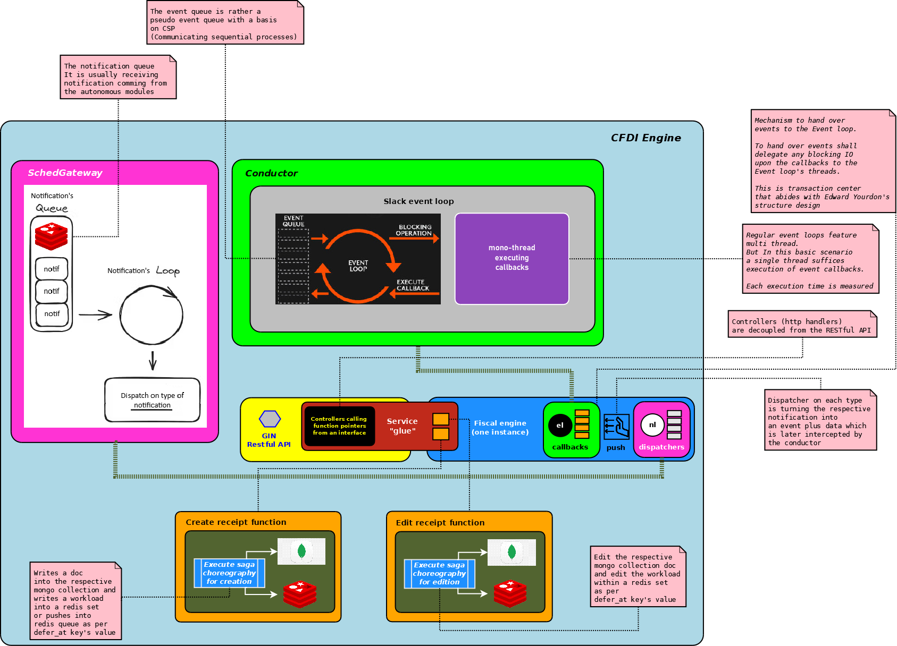
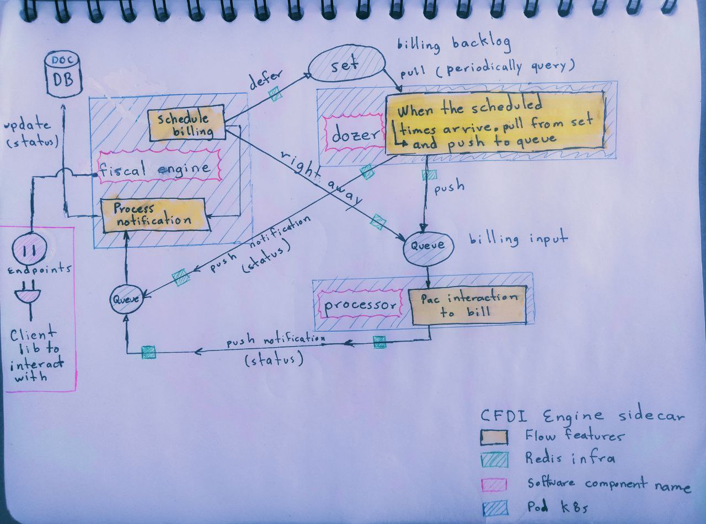

# Fiscal engine (AKA the cfdi-engine)

The fiscal engine issues cfdi documents [anexo 20][1] through PAC's API.

<details>

<summary> Design aspects </summary>

## Internal blocks (Structured Programming) of cfdi-engine

Designing code blocks effectively is crucial for writing clean, maintainable, and efficient software. So does cfdi-engine



## The coordination among the autonomous modules

1.  When the client part has defined (via cfdi-engine endpoint) the date/time to issue an cdfi document then...
2.  A workload shall be generated and placed into a Redis SET along with its time for subsequent cfdi-processor's consumption
3.  Then the cfdi-dozer shall always be tracking which workloads of this SET have reached their time
4.  The cfdi-processor shall adapt the workload to the specifications of the request asked by the PAC
5.  The cfdi-processor shall notify the cfdi-engine if the result was positive or negative
6.  Through an endpoint in fiscal-engine any client's application shall be able to inquiry the workload's info (or employ a webhook if necessary)



---

**A few NOTES about the above design**

> Each component (cfdi-engine, cfdi-dozer, cfdi-processor) has a defined role, promoting a decoupled architecture. This makes it easier to maintain and scale each module independently.

> The feedback mechanism (cfdi-processor notifying cfdi-engine) ensures that the client is informed about the status of their request, which is critical for system transparency.

> Providing access to workload status through the fiscal-engine endpoint or webhooks is a user-friendly feature, allowing for real-time updates and integration with client systems.

---

<details>

<summary> Messages </summary>

### The immutable ones

The immutable messages exchanged between the autonomous modules lends use of the language from the domain.

#### Formats

These are designed for purposes of flow control and they have their uses.

##### Billing workload's format

It's pretty similar to the prefactura's model ( in fact that is a snapshot from, at the time the workload has been scheduled).

```js
{
    _id: '671d187eb73c76706bd593cb',
    owner: 'viajes Ponchito',
    receptor_rfc: 'PACE8001104V2',
    receptor_data_ref: 'be7dd373-137f-4ec6-be87-08ebe86a714d',
    document_currency: 'MXN',
    base_currency: 'MXN',
    exchange_rate: 1.0,
    subtotal_amount: 502.5,
    total_transfers: 80.4,
    total_amount: 582.9,
    items: [
      {
        product_id: '10201501',
        product_desc: 'Frasco vitacilina',
        product_quantity: 5,
        product_unit_price: 100.5,
        product_amount: 502.5,
        product_transfers: [
          {
            base: 502.5,
            rate: 0.16,
            amount: 80.4,
            fiscal_factor: 'Tasa',
            fiscal_type: '002',
            transfer: true
          }
        ]
      }
    ],
    purpose: 'sale',
    payment_way: 'credit_card',
    payment_method: 'PUE',
    chronology: { scheduled_at: ISODate('2024-10-26T16:25:56.000Z') },
    total_deductions: 0
}
```

#### Event Notification's formats

It occurs when the job has been defered by cfdi-engine (it is then delegated to the cfdi-dozer).

```js
{
    type: "HAND_OVER_TO_DOZER",
    "receipt_id": "12345",
    timestamp: 1634020500
}
```

It is usually issued by the cfdi-dozer when handing over the job to the cfdi-processor.
It can also occurs artificially when cfdi-engine pushes directly the job into cfdi-processor's queue.

```js
{
    type: "HAND_OVER_TO_PROCESSOR",
    "receipt_id": "12345",
    "timestamp": 1634020500
}
```

It is sadly issued by the cfdi-processor when an error occurs during cfdi's creation.

```js
{
    "type": "BAD_OUTCOME_FROM_PROCESSOR",
    "receipt_id": "12345",
    "timestamp": 1634020500
}
```

It is issued by the cfdi-processor when a cfdi has been succesfully created

```js
{
    "type": "GOOD_OUTCOME_FROM_PROCESSOR",
    "receipt_id": "12345",
    "timestamp": 1634020500,
    "doc_uuid": "22473ed7a32c265cd1138ba1a85afdf9a5744"   # Correlate the PAC's backend cfdi to the receipt's id
}
```

</details>
</details>

<details>

<summary>Consumer's guide</summary>

## How to use it

The following examples demonstrate how to create, update a receipt via the cfdi-engine's REST API.

### Create receipt

This command creates a new receipt for specific receptor.

```sh

pianodaemon@LAPTOP-4RSVIK4C:~$ curl -X POST http://localhost:8080/receipts \
-H "Content-Type: application/json" \
-d '{
    "owner": "viajes Ponchito",
    "receptor_rfc": "XAXX010101000",
    "receptor_data_ref": "66ec233077430",
    "document_currency": "MXN",
    "base_currency": "MXN",
    "exchange_rate": 1.0,
    "items": [
        {
            "fiscal_product_id": "10201501",
            "product_quantity": 5,
            "fiscal_product_unit": "C81",
            "product_unit": "PZA",
            "product_unit_price": 100.50,
            "product_desc": "Product Description",
            "product_id": "prod0002",
            "product_transfers": [
                {
                    "fiscal_type": "002",
                    "fiscal_factor": "Tasa",
                    "rate": 0.16,
                    "transfer": true
                }
            ],
            "product_deductions": []
        }
    ],
    "purpose": "S01",
    "serie": 60659,
    "payment_way": "03",
    "payment_method": "PUE",
    "comments": "Esta factura es un quilombo",
    "chronology": { "defer_at": 1730732995 }
}'
```

**Explanation**:

- This `POST` request creates a new receipt featuring serie `60659`, owned by `viajes Ponchito` for `MXN` currency.
- It shall be processed at 9:10 am CDT in Nov 4.

### Update receipt

This command updates an existing receipt for specific receptor.

```sh

pianodaemon@LAPTOP-4RSVIK4C:~$ curl -X PUT http://localhost:8080/receipts/671d187eb73c76706bd593cb \
-H "Content-Type: application/json" \
-d '{
    "owner": "viajes Ponchito",
    "receptor_rfc": "XAXX010101000",
    "receptor_data_ref": "66ec233077430",
    "document_currency": "MXN",
    "base_currency": "MXN",
    "exchange_rate": 1.0,
    "items": [
        {
            "fiscal_product_id": "10201501",
            "product_quantity": 5,
            "fiscal_product_unit": "C81",
            "product_unit": "PZA",
            "product_unit_price": 100.50,
            "product_desc": "Product Description",
            "product_id": "prod0002",
            "product_transfers": [
                {
                    "fiscal_type": "002",
                    "fiscal_factor": "Tasa",
                    "rate": 0.16,
                    "transfer": true
                }
            ],
            "product_deductions": []
        }
    ],
    "purpose": "S01",
    "serie": 60659,
    "payment_way": "03",
    "payment_method": "PUE",
    "comments": "Esta factura es un quilombo",
    "chronology": { "defer_at": 1 }
}'
```

**Explanation**:

- This PUT request updates the receipt for immediate processing ( set the value as 1 to carry out the trick )

### Cancel receipt

This command cancels an existing receipt for specific receptor. If you have questions regarding the motive, you can read more about on this [link](https://factura.com/apidocs/cancelar-cfdi-40.html#cancelar-cfdi-4-0) This endpoint receives `receipt_id` && `purpose`, neverteless if you need to cancel with relation you have to send `replacement_uuid`

| Motive | Description                                          |
| ------ | ---------------------------------------------------- |
| `01`   | Invoice with errors and related                      |
| `02`   | Invoice with errors and not related                  |
| `03`   | The operation wasn't carry on                        |
| `04`   | Nominative transaction related to the global invoice |

```sh

pianodaemon@LAPTOP-4RSVIK4C:~$ curl -X POST http://localhost:8080/receipts/cancel/671d187eb73c76706bd593cb/03 \
-H "Content-Type: application/json"

```

###### Cancelation related with uuid

```sh

pianodaemon@LAPTOP-4RSVIK4C:~$ curl -X POST http://localhost:8080/receipts/cancel/671d187eb73c76706bd593cb/01/7cd21022-ac7a-41dd-9e79-2956f22d718d \
-H "Content-Type: application/json"

```

[1]: http://omawww.sat.gob.mx/tramitesyservicios/Paginas/anexo_20.htm
[2]: https://docs.microsoft.com/en-us/azure/architecture/patterns/async-request-reply

```

```

### Retry receipt

This endpoint is to make a new processing attempt for a receipt that has failed. Here is an example call to the endpoint:

```sh
curl --location --request PUT 'localhost:8080/receipts/6780037c2f73880f1dcb05a6/retry'
```

where `6780037c2f73880f1dcb05a6` corresponds to the `{receipt ID}`. So the endpoint has the following form:

```sh
localhost:8080/receipts/{receipt ID}/retry
```

### Delete Receipt

Endpoint to delete a single receipt from the Database, the only way to delete it is with the following validation:

```js
{
    "_id": id, // ID of the receipt, obviously this is parsed as an IdObject...
    "meta": {
        "$eq": {},
    },
    "chronology": {
        "$exists": true,
    },
    "chronology.defer_at": {
        "$exists": false, // If the receipt has defer_at, you can't delete it.
    },
}
```

| Parameter   | Obligatory | type     | Description                 |
| ----------- | ---------- | -------- | --------------------------- |
| `receiptID` | `true`     | `string` | Receipt ID based on MongoDB |

```sh
curl --location --request DELETE 'localhost:8080/receipts/6780037c2f73880f1dcb05a6'
```

where `6780037c2f73880f1dcb05a6` corresponds to the `{receipt ID}`. So the endpoint has the following form:

```sh
localhost:8080/receipts/{receipt ID}
```

</details>
